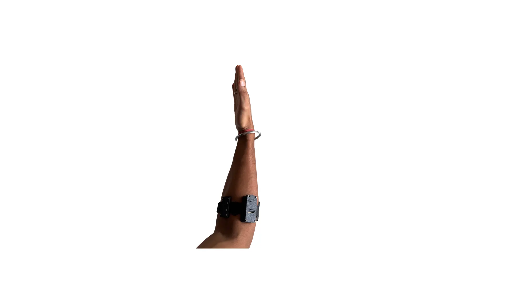
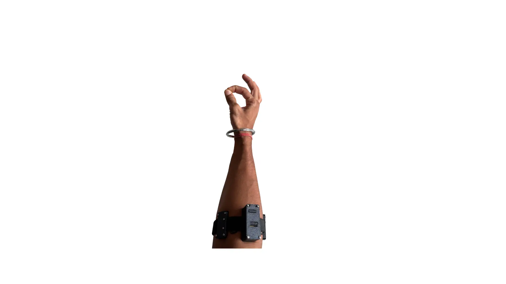
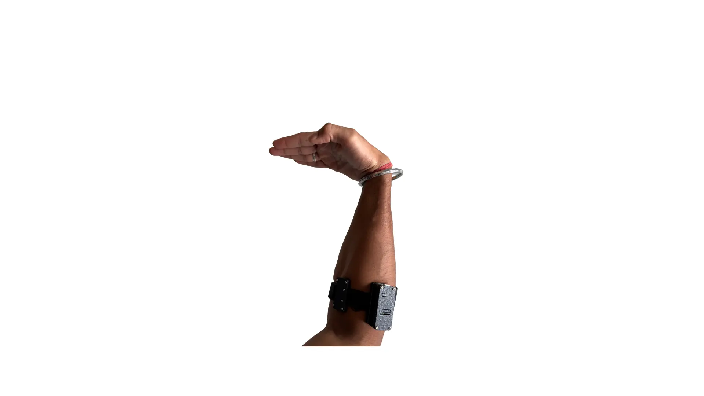
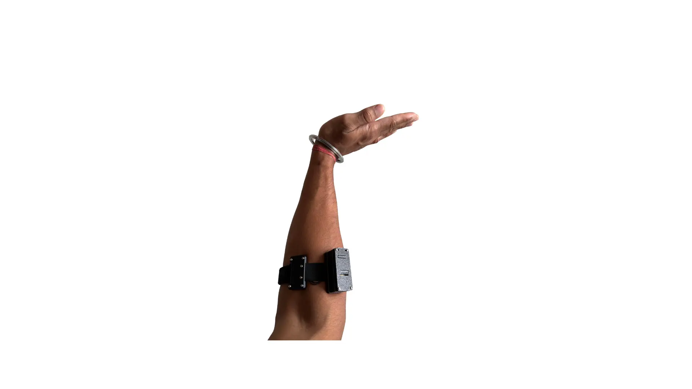

# NPG Lite ArmBand - Gesture ML Toolkit

Record EMG gestures from an NPG Lite ArmBand, train a model on them, and use
your arm to control a browser dashboard or your keyboard.

**Never used a terminal before? That's fine.** This README assumes zero prior
experience. Follow it top to bottom and don't skip the hardware section —
most problems people hit are the board being off, or the band being in the
wrong place, not the software.

---

## Table of contents

1. [What you need](#1-what-you-need)
2. [Get the project onto your computer](#2-get-the-project-onto-your-computer)
3. [Turn on the NPG Lite (do this before anything else)](#3-turn-on-the-npg-lite-do-this-before-anything-else)
4. [Where to wear the ArmBand](#4-where-to-wear-the-armband)
5. [Run the setup script](#5-run-the-setup-script)
6. [How the menu works](#6-how-the-menu-works)
7. [Option 1 — Record gesture data](#option-1--record-gesture-data)
8. [Option 2 — Train gesture model](#option-2--train-gesture-model)
9. [Option 3 — Run gesture UI server](#option-3--run-gesture-ui-server)
10. [Option 4 — Run gesture controller (tap / hold)](#option-4--run-gesture-controller-tap--hold)
11. [The gestures](#the-gestures)
12. [Advanced: tuning flags](#advanced-tuning-flags)
13. [Troubleshooting](#troubleshooting)
14. [Manual setup (no scripts)](#manual-setup-no-scripts)
15. [What each file is](#what-each-file-is)

---

## 1. What you need

**Hardware**

- An **NPG Lite** board with the **ArmBand** (EMG electrodes) attached
- The board's battery charged, or a USB cable to power it
- A computer with **Bluetooth** (built-in BLE, or a BLE USB dongle)

**Software**

- Nothing pre-installed. The setup script installs Python and everything else
  for you if they're missing.

**Bluetooth notes before you start**

- Bluetooth must be **turned on** in your computer's settings.
- **Do not** pair the NPG Lite in your OS Bluetooth settings. These scripts
  connect to it directly (BLE), so pairing it manually can actually get in the
  way. If you already paired it, remove/forget it.
- **Only one program can be connected to the board at a time.** If the Chords
  web app, a phone app, or another one of these scripts is connected, close it
  first — otherwise the new one will scan forever and find nothing.

---

## 2. Get the project onto your computer

Don't download the files one by one — get the **whole repo** so the scripts
and the setup files all land in the same folder.

- **Clone it:**
  ```bash
  git clone <repo-url>
  cd <repo-folder>
  ```
- **Or download a ZIP:** on the repo's GitHub page click
  **Code → Download ZIP**, then unzip it and open the extracted folder.

You should end up with **one folder** containing:

```
record_gesture.py       train_gesture_model.py   gesture_ui_server.py
gesture_controller.py   model_architectures.py   requirements.txt
setup_and_run.bat       setup_and_run.sh         setup_and_run.command
gesture_model/          (a pretrained model, ready to use)
```

**Windows users:** move this folder somewhere short and simple like
`C:\Dev\NPG-Lite` — **not** Desktop, **not** Downloads. Windows security
policies and path-length limits cause real, confusing failures from those two
folders (both are covered in [Troubleshooting](#troubleshooting)).

### You can try it immediately

The repo already ships a **trained model** in `gesture_model/`, so you don't
have to record or train anything to try it. It recognises 3 gestures out of
the box: **pinch**, **flexion**, **extension** (plus **rest** = doing
nothing). Skip straight to option 3 or option 4 in the menu.

---

## 3. Turn on the NPG Lite (do this before anything else)

**This is the single most common reason "no device found" happens.**

Before you pick menu option **1**, **3**, or **4**:

1. **Power the board on.** Flip the power switch on / plug in USB. Check the
   power LED is lit.
2. **Confirm it's advertising.** The board advertises itself over Bluetooth as
   a device whose name starts with **`NPG-Lite-Band`**. If the firmware is
   running, it starts advertising within a second or two of power-on.
3. **Keep it close** — same room, within a couple of metres, no metal or a
   body between the board and the computer for the first connection.
4. **Wait for the scan.** When a script starts it prints something like
   `Scanning for NPG-Lite devices...` and takes a few seconds. Don't press
   anything — let it finish.
5. **If more than one board is found**, the script lists them and asks you to
   pick one:
   ```
   Found 2 NPG-Lite devices:
     1) NPG-Lite-Band  (EE:FF)
     2) NPG-Lite-Band  (55:66)
   Select device to use [1-2]:
   ```
   Type `1` (or `2`) and **press Enter**.

**Option 2 (training) is the only option that does NOT need the board** — it
just reads files off your disk, so the board can be off.

**When you're done**, press `Ctrl+C` in the terminal window to stop the
script, then power the board off to save battery.

---

## 4. Where to wear the ArmBand

<!-- TODO: add a photo showing correct placement/orientation on the forearm -->


- Place the ArmBand on your **forearm**, **electrodes facing your skin**.
- Position it over the **muscle belly** — roughly the **upper third of the
  forearm, just below the elbow**. That's where pinch / flexion / extension
  activity is strongest.
- **Snug, not tight.** If it slides around, the signal jumps. If it cuts off
  circulation, it's too tight.
- **Same orientation every time.** The bundled pretrained model was trained on
  one specific placement and rotation. Rotate the band 90° and the model sees
  a different signal.
- Slightly damp skin helps contact. Very dry skin, hair, or body lotion hurts
  it.
- **Once it's on, leave it on** for the whole session. Re-seating it mid-session
  changes the signal and you'll need to recalibrate.

---

## 5. Run the setup script

The setup script does everything: installs Python if missing, creates a local
`venv` folder, installs the required packages into it, then shows you a menu.
It's **safe to re-run any time** — it skips whatever is already done.

The very first run downloads TensorFlow and can take **5–15 minutes**. Later
runs start in seconds.

### Windows

Double-click **`setup_and_run.bat`**.

- If Python isn't installed, it silently downloads and installs Python 3.12.7.
- If SmartScreen warns you, click **More info → Run anyway**.
- If you get **"Smart App Control blocked a file that may be unsafe"** (no
  "Run anyway" button), see [Troubleshooting](#troubleshooting).

### macOS

The executable permission doesn't survive a git clone or ZIP download, so
**first time only**, open Terminal in the project folder and run:

```bash
chmod +x setup_and_run.sh setup_and_run.command
```

Then double-click **`setup_and_run.command`**. The first time, macOS may
require **right-click → Open** instead of a double-click (to get past the
"unidentified developer" warning). After that, double-clicking works.

- If Python is missing it installs it via Homebrew, or downloads the official
  python.org installer.
- macOS will pop up permission prompts the first time: **Bluetooth** (needed
  for all BLE options) and, for option 4, **Accessibility** (needed to press
  keys). Allow both — see [Troubleshooting](#troubleshooting) if you miss the
  prompt.

### Linux

**First time only:**

```bash
chmod +x setup_and_run.sh
```

Then run it from a terminal:

```bash
./setup_and_run.sh
```

- If Python is missing it installs it with your distro's package manager
  (`apt`, `dnf`, `pacman`, or `zypper`) and will ask for your `sudo` password.
- If you see `permission denied: ./setup_and_run.sh`, the `chmod +x` step was
  skipped — run it once and it'll work from then on.

---

## 6. How the menu works

Once setup finishes you'll see this:

```
================================================
  Gesture ML Toolkit
================================================

  Turn ON your NPG Lite board before picking 1, 3 or 4.

  1. Record gesture data     (record_gesture.py)
  2. Train gesture model     (train_gesture_model.py)
  3. Run gesture UI server   (gesture_ui_server.py)
  4. Run gesture controller  (gesture_controller.py - tap / hold)
  5. Exit

Type a number [1-5] and press Enter:
```

**How to choose an option — read this if you're new to terminals:**

- **Type just the number** (`1`, `2`, `3`, `4`, or `5`) — not the words next
  to it.
- **Then press the Enter / Return key.** Typing the number alone does nothing;
  the terminal waits for Enter before it acts. This is true for **every**
  prompt in every script — device selection, subject name, yes/no questions,
  all of them.
- **Clicking the menu text does nothing.** A terminal only reads what you type.
- If you typo, press **Backspace** before Enter. If you already pressed Enter
  and it says `Invalid choice`, just type the right number and press Enter
  again — nothing is broken.
- **When a script finishes**, you'll see `Press Enter to continue...`. Press
  Enter and you're back at this menu.
- **To stop a running script early**, click the terminal window and press
  **`Ctrl+C`** (`Control+C` on macOS too — not `Cmd+C`).
- **To quit completely**, choose **5** and press Enter, or just close the
  window.

**What order to do things in:**

- **Just want to try it?** → **3** (browser dashboard) or **4** (control your
  keyboard). The bundled model works immediately.
- **Gestures being misread?** → **1** (record your own data) → **2** (train on
  it) → then **3** or **4** again.

---

## Option 1 — Record gesture data

Records your own gesture trials to CSV files, so you can train a model on
**your** arm instead of someone else's.

**Board must be ON.** Requires the ArmBand worn as described above.

**What happens, step by step:**

1. It scans for the board and connects. If several are found, pick a number
   and press Enter.
2. **`Enter subject name:`** — type a name for the person being recorded (e.g.
   `krishnanshu`) and press Enter. This becomes a folder name, so it's
   lowercased and stripped of spaces/symbols automatically. Use the **same
   name** every session so all your data stays together.
3. **`Record 'rest' baseline trials now? [Y/n]:`** — press Enter (which means
   yes) the first time. "Rest" teaches the model what *doing nothing* looks
   like; without it, the model is forced to guess an active gesture even when
   your arm is idle. It then asks how many rest trials — press Enter for the
   default of 3.
4. **`Enter gesture name:`** — type `pinch`, `flexion`, or `extension` (one at
   a time) and press Enter. Also accepted here:
   - `sessions` — review your recordings and toggle which ones get used for
     training
   - `q` — quit back to the menu
5. **The beep cue.** One recording contains **many short reps**, not one long
   hold. For each rep:
   - **one high beep = GO** — start the gesture now
   - **hold it** for a *random* 1.5–5 seconds (random on purpose, so you can't
     pre-time the release and start counting instead of listening)
   - **two low beeps = STOP** — relax
   - a few seconds of relax, then the next GO beep
   You never have to guess how long to hold — the stop beep tells you. A trial
   auto-stops after 60 seconds.
6. Only the clean window between GO and STOP is kept (the first 0.3 s after
   GO is discarded as reaction time). Everything else is thrown away, so a
   sloppy relax gap won't poison your data.

**Tips for good data**

- Turn your volume up enough to clearly hear the beeps.
- Do the gesture the same way every rep, at a natural effort level.
- Record **all three gestures plus rest**, in roughly equal amounts.
- **3–5 trials per gesture** is a reasonable starting point. More is better.
- Don't move your whole arm around during EMG-only gestures (flexion,
  extension) — that adds accelerometer noise.

Everything is saved under `training_data/<subject>/<gesture>/`, plus a
`training_data/dataset_index.json` that tracks every session.

---

## Option 2 — Train gesture model

Reads the CSVs you recorded and trains a model from them.

**The board does NOT need to be on for this** — it only reads files.

- No questions to answer; it just runs.
- It slices your recordings into 0.5-second windows, normalises them, trains a
  **CNN-LSTM** for up to 60 epochs, then evaluates on data it never trained
  on and prints a per-class report and confusion matrix.
- It takes anywhere from **a couple of minutes to ~20 minutes** depending on
  how much data you recorded and how fast your computer is.
- Any session you flagged off in option 1's `sessions` menu is skipped
  automatically.
- The result is written to **`gesture_model/`**, replacing the bundled
  pretrained model. Options 3 and 4 will use your new model from then on. If
  you want to keep the original, copy the `gesture_model` folder somewhere
  else before training.

**Reading the output:** look at the per-class accuracy in the test report. If
one gesture is much worse than the others, record more trials of *that*
gesture and train again.

---

## Option 3 — Run gesture UI server

A browser dashboard showing an animated hand that follows your live gesture,
with a confidence bar and per-class probability bars. **This does not press any
keys** — it's the safest way to check that everything works.

**Board must be ON.**

- It connects to the board, loads the model, starts a tiny local web server,
  and **opens `http://localhost:8765` in your browser automatically**.
- If no tab opens, open that address yourself.
- Make gestures and watch the hand. If the right gesture lights up reliably,
  your placement and model are good.
- **Stop it with `Ctrl+C`** in the terminal (closing the browser tab doesn't
  stop the server).

Nothing is installed for this beyond the normal requirements.

---

## Option 4 — Run gesture controller (tap / hold)

Turns your gestures into **real arrow-key presses**, so you can control games,
presentations, video playback, or anything else that reads the keyboard.

**Board must be ON**, worn as described above.

Choosing **4** opens a submenu:

```
================================================
  Gesture Controller - keyboard control
================================================

  1. TAP mode   - one gesture = one key press
                  (menus, browsing, turn-based games)
  2. HOLD mode  - key stays held down while you hold the gesture
                  (driving/racing games, continuous steering)
  3. TAP mode, DRY RUN - shows what it detects, sends NO key
                  presses. Use this first to test safely.
  4. Back to main menu

Type a number [1-4] and press Enter:
```

Same rule as before: **type the number, press Enter.**

### Which mode do I want?

| Mode | What it does | Good for |
|---|---|---|
| **TAP** | One gesture = **one** keystroke. Held ~60 ms, then released. You must return to rest before the same key can fire again. | Menus, slideshows, browsing, page navigation, turn-based games, anything where one action per gesture is right. |
| **HOLD** | The key stays **physically down** for as long as you hold the gesture, and lifts when you relax. | Driving/racing games and anything reading key *state* every frame. A 60 ms tap gives a racing game a single frame of steering — useless. Hold mode is what makes steering actually work. |
| **DRY RUN** | Full detection, on-screen readout, **no keystrokes sent at all**. | **Start here.** Confirms detection works without stray key presses landing in whatever window has focus. |

### The gesture → key mapping

| Your gesture | Key pressed |
|---|---|
| **Flexion** (curl wrist in) | **Left arrow** |
| **Extension** (bend wrist back) | **Right arrow** |
| Arm held **UP** + **pinch** | **Up arrow** |
| Arm held **DOWN** + **pinch** | **Down arrow** |
| Arm at **rest** + pinch | nothing (deliberately) |

Up/Down need **two things at once**: your arm in the up or down *position*
(read from the accelerometer) **and** a pinch as the trigger. A pinch with
your arm at rest fires nothing — that's what stops accidental presses.

### Calibration runs automatically

As soon as the board connects, the controller walks you through a 3-step
calibration so it knows what *your* up, down, and rest positions are:

```
CALIBRATION SEQUENCE STARTING

  1 UP position
  2 DOWN position
  3 REST position
```

Each step gives you a **2-second countdown**, then records ~50 accelerometer
samples with a progress bar. Just do what it says:

1. **UP** — raise your hand above neutral and **hold still** until the bar
   fills
2. **DOWN** — lower your hand below neutral, hold still
3. **REST** — let your arm sit **exactly how you'll actually hold it** while
   using this

That last one matters most. Calibrate "rest" in your real playing posture — if
you calibrate rest with your arm on the desk and then lift it to play, the
controller thinks you're permanently in the UP zone and pinch will fire UP the
whole time. It does warn you about this:

```
  arm has read UP for 8s+ without returning to REST ... recalibrate.
```

If you see that, press `Ctrl+C` and start option 4 again.

You should also **recalibrate** if you move the band, change chairs/posture,
or the up/down direction feels inverted.

### The live status line

Once calibrated you get a single continuously-updating line:

```
PINCH     | raw:pinc | p=0.87/0.66 | 12ms | acc:   -4210 | pos:UP    | v:  +3100 | key:  61ms |  PINCH @ UP → FIRE
```

- `PINCH` — the accepted gesture (after vote filtering)
- `raw:` — the raw single-window prediction before filtering
- `p=0.87/0.66` — confidence vs. the threshold it had to beat
- `12ms` — model inference time
- `acc:` / `pos:` / `v:` — accelerometer value, which zone you're in, distance
  from calibrated rest
- `key:` — how long the last key press took
- the tail tells you what it's doing right now (` Idle`, ` PINCH @ REST (no
  button)`, ` Debounce`, ` HOLDING LEFT`, …)

In tap mode there's a **300 ms debounce** between presses, and the same key
can't repeat within **500 ms** unless you return to rest first.

### Using it with a game

1. Run **dry run (3)** first. Confirm the gestures you want are detected
   cleanly.
2. `Ctrl+C`, then start **tap (1)** or **hold (2)**.
3. **Click on the game window** so it has keyboard focus — keystrokes go to
   whatever window is focused, not to the terminal.
4. Play. `Ctrl+C` in the terminal (or Alt-Tab back to it) to stop.

On exit the controller **releases every key it was holding**, even if you
`Ctrl+C` mid-hold, so you won't be left with a key stuck down.

### One-time permission setup

The controller needs permission to inject keystrokes. The setup script
installs the `pynput` package for you on first use; the OS-level permission is
on you:

- **Windows** — nothing to do. If a game doesn't respond, run the setup script
  as Administrator (some games ignore input from lower-privilege processes).
- **macOS** — the first run pops up
  **System Settings → Privacy & Security → Accessibility**. Enable **Terminal**
  (or iTerm, whichever you launched from), then restart the script. Without
  this, macOS silently swallows every keystroke.
- **Linux** — it prefers the kernel-level `uinput` backend, which works on
  X11, Wayland, and with games that read evdev directly. If it prints "No
  working injection backend", run the commands it prints:
  ```bash
  sudo modprobe uinput
  sudo usermod -aG input $USER    # then log out and back in
  echo 'KERNEL=="uinput", GROUP="input", MODE="0660", OPTIONS+="static_node=uinput"' \
    | sudo tee /etc/udev/rules.d/99-uinput.rules
  sudo udevadm control --reload-rules && sudo udevadm trigger
  ```

---

## The gestures

<!-- TODO: add a photo/GIF for each gesture below so users can see exactly
     how to perform it -->

| Gesture | How to do it |
|---|---|
| Pinch |  |
| Flexion |  |
| Extension |  |

**Rest** is the fourth class: arm relaxed, muscles idle. It isn't a gesture
you perform — it's what the model should say when you're not doing anything.

### If gestures aren't recognised correctly

The bundled model was trained on one specific person's arm, hand size, and
electrode placement, so it won't generalise perfectly to everyone. Before
retraining, try the cheap fixes:

1. Re-seat the band over the muscle belly, snug, correct orientation.
2. Restart option 4 to recalibrate.
3. Exaggerate the gesture slightly and hold it a beat longer.

If it's still unreliable, train your own model:

1. **Option 1** — record your own pinch / flexion / extension **and rest**
   trials.
2. **Option 2** — train on your own data.
3. **Option 3 or 4** — it now uses your model and should track you much better.

---

## Advanced: tuning flags

The menu covers the common cases. For finer control, run the scripts directly
with flags (activate the venv first — see
[Manual setup](#manual-setup-no-scripts)).

**Gesture controller** (`python gesture_controller.py --help` for the full
list):

| Flag | Default | What it does |
|---|---|---|
| `--press_mode tap\|hold` | `tap` | What the menu's options 1 and 2 set. |
| `--dry_run` | off | Detect and log, send no keystrokes. |
| `--debounce_ms` | 300 | Minimum ms between presses in tap mode. |
| `--same_button_ms` | 500 | Minimum ms before the *same* key can repeat. |
| `--allow_hold_repeat` | off | Let a held gesture auto-repeat instead of requiring a return to rest. |
| `--class_thresholds` | per-class | Confidence needed per gesture, e.g. `flexion=0.50,extension=0.91`. Raise a class if it false-fires; lower it for faster response. **Re-derive these after retraining** — they're properties of one specific model. |
| `--votes` / `--votes_needed` | 5 / 4 | A label is only accepted after N of the last M windows agree. Raise for stability, lower for speed. |
| `--hold_votes` | 3 | Votes needed to *keep* holding in hold mode. Lower = stickier hold, slower release. |
| `--key_hold_ms` | 60 | How long each key is physically held. Raise to 80–100 if a game misses presses. |
| `--key_watchdog_ms` | 400 | In hold mode, release everything if predictions stop arriving (BLE dropout). Stops keys sticking. |
| `--pinch_mode position\|velocity` | `position` | `position`: pinch fires whichever zone your arm is in. `velocity`: pinch must coincide with actual motion. |
| `--pos_enter_frac` / `--pos_exit_frac` | 0.60 / 0.35 | How far toward up/down you must move to enter that zone, and fall back out of it (hysteresis). |
| `--key_backend` | `auto` | `uinput`, `pynput`, `xdotool`, or `none`. |

**Recording** (`record_gesture.py`): `--gesture_hold_min` / `--gesture_hold_max`
(1.5 / 5.0 s hold range), `--rep_interval` (3.0 s relax between reps),
`--max_record_seconds` (60), `--all_devices` (connect to every board in range).

**Training** (`train_gesture_model.py`): `--arch cnn|lstm|cnn_lstm`
(default `cnn_lstm`), `--window_size` (250 = 0.5 s at 500 Hz), `--stride` (125
= 50 % overlap), `--epochs` (60), `--subject <name>` (train on one person
only), `--out_dir`.

**UI server** (`gesture_ui_server.py`): `--port` (8765), `--no_browser`,
`--confidence_threshold` (0.95).

---

## Troubleshooting

### "No NPG-Lite device found" / it scans forever

In order of likelihood:

1. **The board is off.** Power LED lit?
2. **Something else is already connected to it** — the Chords web app, a phone
   app, or another one of these scripts still running in another window. Close
   it. Only one connection at a time.
3. **Bluetooth is off** on your computer, or the BLE adapter is disabled.
4. **You paired it in OS Bluetooth settings.** Forget/remove the device — these
   scripts connect directly and pairing can block that.
5. **Too far / obstructed.** Bring it within a couple of metres, clear line of
   sight.
6. **Battery low.** A low board may advertise weakly or not at all. Charge or
   plug in USB.
7. **Linux:** `sudo systemctl restart bluetooth`, then try again. macOS: make
   sure the Bluetooth permission prompt was allowed
   (**System Settings → Privacy & Security → Bluetooth**).

### The controller detects gestures but nothing happens in my game/app

- **The wrong window has focus.** Click the game first — keystrokes go to the
  focused window.
- **You're in dry-run mode** (option 3). Use option 1 or 2 instead.
- **The game reads key state per frame** (racing/driving) — use **hold mode**,
  not tap.
- **The game still misses presses** — raise the hold time:
  `python gesture_controller.py --press_mode tap --key_hold_ms 100`
- **macOS**: Accessibility permission not granted (see option 4 above).
- **Windows**: try running the setup script as Administrator.
- **Linux**: it fell back to `pynput`/XTest, which Wayland-native apps and
  evdev-reading games ignore. Set up `uinput` (see option 4 above).

### Pinch keeps firing UP (or DOWN) when I'm doing nothing

Your calibrated "rest" doesn't match how you're actually holding your arm.
`Ctrl+C`, restart option 4, and during the REST step hold your arm exactly as
you will while playing.

### `pos_exit_frac >= pos_enter_frac` warning

Harmless — you passed values that would disable hysteresis, so it clamped
them. Ignore it unless you set those flags on purpose.

### `Invalid choice` when picking a menu option

You typed something other than a plain number, or included the option text.
Type just the digit, then Enter.

### `ImportError: DLL load failed ... An Application Control policy has blocked this file` (Windows)

Usually appears while importing `pandas` during **option 2**. It's not a broken
install — Windows (Smart App Control / Application Control policy) is blocking
one of pandas' compiled files, and it's stricter for files in `Downloads`.

1. **Move the whole project folder out of `Downloads`**, to something like
   `C:\Dev\NPG-Lite-ArmBand-Software` (avoid Desktop and Downloads).
2. Open PowerShell in the new location and unblock everything:
   ```powershell
   Get-ChildItem -Recurse | Unblock-File
   ```
3. Delete the `venv` folder and let the setup script recreate it, so packages
   reinstall fresh in the new location.
4. On a work/school-managed PC this may be IT policy — you may need Python
   allow-listed, or run from an already-open terminal instead of
   double-clicking.

### "Smart App Control blocked a file that may be unsafe" (Windows)

Stricter than SmartScreen, and it has no "Run anyway" button. Unblock the file
manually:

1. Right-click `setup_and_run.bat` → **Properties**
2. At the bottom of the **General** tab, tick **Unblock**
3. **Apply → OK**, then run it again

Still blocked? Smart App Control may be in enforced mode. Either run
`setup_and_run.bat` from an already-open PowerShell/Command Prompt in that
folder, or turn Smart App Control off via **Settings → Privacy & security →
Windows Security → App & browser control → Smart App Control settings → Off**.
(On Windows 11 that's generally a one-way switch — you can't turn it back on
without reinstalling Windows.)

### `OSError: ... No such file or directory ... tensorflow\include\external\envoy_api\...` during `pip install` (Windows)

**Windows path length limits.** Some TensorFlow header paths exceed the default
260-character limit, so pip fails partway through even though the download
succeeded.

1. Open **PowerShell as Administrator**.
2. Run:
   ```powershell
   New-ItemProperty -Path "HKLM:\SYSTEM\CurrentControlSet\Control\FileSystem" -Name "LongPathsEnabled" -Value 1 -PropertyType DWORD -Force
   ```
3. **Restart your computer** (required).
4. Run the setup script again — it picks up where it left off.

Keeping the project path short (`C:\Dev\NPG-Lite` rather than a deeply nested
`Downloads\NPG-Lite-ArmBand-Software-main\NPG-Lite-ArmBand-Software-main`)
makes this less likely in the first place, but enabling long paths is the real
fix.

### `zsh: permission denied: ./setup_and_run.sh` (macOS/Linux)

The `chmod +x` step was skipped. Run it once:

```bash
chmod +x setup_and_run.sh setup_and_run.command
```

### Option 2 fails with "no data found"

You haven't recorded anything yet, or every session is toggled off. Run option
1 first, or check the `sessions` menu inside option 1.

### `pynput could not be installed`

Key presses won't work until it's installed. Activate the venv (see below) and
run `pip install pynput` yourself to see the real error. On Linux you can skip
it entirely if you set up the `uinput` backend instead.

---

## Manual setup (no scripts)

The setup scripts just automate the steps below. Do this by hand if you prefer,
or if the scripts don't work on your machine.

### 1. Install Python

Install **Python 3.12.7** (any 3.10+ works — 3.12.7 is what this was tested
with).

- **Windows**: download
  https://www.python.org/ftp/python/3.12.7/python-3.12.7-amd64.exe and run it.
  **Check "Add python.exe to PATH"** on the first screen — it's off by default
  and is the #1 reason `python` isn't recognised afterward.
- **macOS**: `brew install python@3.12`, or
  https://www.python.org/ftp/python/3.12.7/python-3.12.7-macos11.pkg
- **Linux**: `sudo apt-get install python3 python3-venv python3-pip` (or your
  distro's equivalent)

Check it:
```
python --version
```
(macOS/Linux: `python3 --version`.)

### 2. Create a virtual environment

A venv is just an isolated folder holding this project's packages, so they
don't clash with anything else on your system. From inside the project folder:

**Windows:** `python -m venv venv`
**macOS/Linux:** `python3 -m venv venv`

Once only.

### 3. Activate it

Do this **every time** you open a new terminal for this project.

- **Windows (Command Prompt):** `venv\Scripts\activate.bat`
- **Windows (PowerShell):** `venv\Scripts\Activate.ps1`
- **macOS/Linux:** `source venv/bin/activate`

Your prompt will show `(venv)` when it worked.

### 4. Install the packages

```
pip install -r requirements.txt
```

That covers `bleak` (BLE), `numpy` / `sounddevice` (beeps + signal math), and
`pandas` / `scikit-learn` / `tensorflow` (training + inference).

For `gesture_controller.py` you also need a keystroke backend:

```
pip install pynput            # all platforms
pip install evdev             # Linux only, optional but better
```

### 5. Run whatever you need

```
python record_gesture.py
python train_gesture_model.py
python gesture_ui_server.py
python gesture_controller.py --press_mode tap
python gesture_controller.py --press_mode hold
python gesture_controller.py --press_mode tap --dry_run
```

Run only the one you want — you don't have to run them all.

### 6. Next time

Skip steps 1–4. Reopen a terminal in the project folder, activate the venv
(step 3), run the script you want (step 5).

---

## What each file is

| File | What it does |
|---|---|
| `record_gesture.py` | Connects to the ArmBand over Bluetooth, plays go/stop beep cues, and saves your filtered EMG + accelerometer data as CSVs for training. |
| `train_gesture_model.py` | Reads the recorded CSVs and trains a gesture classifier, saving the result into `gesture_model/`. |
| `model_architectures.py` | Defines the CNN / LSTM / CNN-LSTM network structures. You don't run this directly — the training script imports it. |
| `gesture_ui_server.py` | Connects live, runs the model in real time, and shows the recognised gesture in a browser dashboard. Presses no keys. |
| `gesture_controller.py` | Connects live and turns gestures into real arrow-key presses (tap or hold mode), with automatic up/down/rest calibration. |
| `gesture_model/` | The trained model files. Ships with a pretrained model so options 3 and 4 work immediately; training overwrites it. |
| `training_data/` | Where `record_gesture.py` saves CSVs and `dataset_index.json`. |
| `requirements.txt` | The package list, used by the setup scripts and the manual `pip install -r` step. |
| `setup_and_run.bat` / `.sh` / `.command` | One-click setup + menu launcher for Windows / Linux / macOS. |

## Notes

- All scripts are safe to re-run: Python install and venv creation are skipped
  if already done, and `pip install -r requirements.txt` only installs what's
  missing or outdated.
- Everything installs into a local `venv/` folder inside the project — nothing
  goes system-wide except Python itself (if it was missing).
- The board can only hold **one** connection at a time. Close option 3 before
  starting option 4, and vice versa.
- Options **1**, **3**, and **4** need the board **on**. Option **2** doesn't.